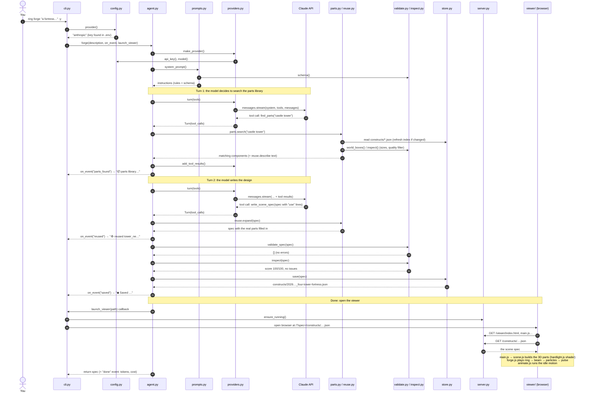

<div align="center">

# 💍 GREEN LANTERN

### *An AI agent that forges anything you imagine out of glowing green hard light.*

*"In brightest day, in blackest night…"*: a fan tribute to the [Green Lantern Corps oath](https://en.wikipedia.org/wiki/Green_Lantern#Oath).

> **The Forger's Oath** *(this project's own)*
>
> *From the smallest seed to the widest sky,*
> *no shape escapes my emerald eye.*
> *What I imagine, light will make,*
> *forged by a will no fear can break.*

</div>

> ⚠️ **Disclaimer:** this is an **unofficial, non-commercial fan project**. Green Lantern and related names and characters are trademarks of **DC Comics**. This project is not affiliated with, endorsed by, or sponsored by DC Comics or Warner Bros. Discovery. The ring, its sigil, the Forger's Oath, the code and every construct here are original work.

---

Type an idea, like *"a dragon guarding a bridge"*, *"a giant mech fist"* or *"a fortress with four towers"*. An AI agent researches it, plans it, reuses parts from things it has built before, designs the rest as a 3D construct, **checks its own work**, fixes its mistakes, and hands it to the ring. Then your browser plays the forging:

1. ✨ **The ring arrives** and its sigil ignites.
2. ⚡ **It fires a beam.** Energy particles stream out and build the construct piece by piece: glowing outlines first, then solid hard light.
3. 💥 **A pulse of light** runs through the finished construct.
4. 🐉 **It comes alive:** wings flap, gears spin, pistons pump, and a soft shimmer runs over everything.

```
$ uv run ring forge "a fortress with four corner towers and a gatehouse" -y
◆ Forging a fortress with four corner towers and a gatehouse
  📦 parts library: castle tower → 5 match(es)
  ♻ reused tower_ne, tower_ne, tower_ne, tower_ne, gatehouse (+45 parts, ≈3,006 tokens not written)
  ✓ write_scene_spec: 59 parts, 7 animations
  ✓ validate_scene_spec: valid · inspector score 100/100
  ◆ Saved constructs/20261007-230413_four-tower-fortress.json
  anthropic · claude-opus-5-5 · effort low · 1 turns · score 100/100 · ~$0.06
◆ Four-Tower Fortress — 59 parts, 7 animations
```

---

## 📍 Where things stand

| | Status |
|---|---|
| **Default brain** | **Claude** (Opus 5.5). Best designs, about 20 s and about $0.08 per construct at the default effort |
| **Free mode** | Works (Groq and Gemini), with health checks, racing and automatic fallback. Designs are solid but **noticeably weaker than Claude's**, and speed depends on free-tier limits |
| **Memory** | A **parts library**: reusable components from everything you've forged. The agent reuses them instead of redesigning. *(Plain keyword index, not a vector database or a knowledge graph; see "Memory" below)* |
| **Research** | Claude searches the web; free models look things up on Wikipedia |
| **Self-checking** | Every design is validated and geometry-inspected (score out of 100), and problems go back to the agent to fix |
| **Next up** | Evaluation suite, tests, GitHub repo and a demo GIF (see the [🗺 Roadmap](#-roadmap)) |

---

## 🚀 Quick start

### 1. What you need
- **[uv](https://docs.astral.sh/uv/)**, which installs Python and every dependency for you.
- **At least one API key:**
  - **Anthropic / Claude** (paid, best quality): [console.anthropic.com](https://console.anthropic.com) → *API Keys*, then add credit under *Billing*
  - **Groq** (free, no credit card): [console.groq.com/keys](https://console.groq.com/keys)
  - **Google Gemini** (free, no credit card): [aistudio.google.com/apikey](https://aistudio.google.com/apikey)
- A web browser (the viewer loads Three.js from a CDN).

### 2. Add your keys
```bash
cp .env.example .env      # first time only
open -e .env
```
Paste each key after its `=` (no quotes, no spaces), then save:
```
ANTHROPIC_API_KEY=sk-ant-...
GROQ_API_KEY=gsk_...
GEMINI_API_KEY=...
```
> 🔒 `.env` is private and git ignores it. Never paste your key into a chat or share the file.

### 3. Watch a sample (free, no AI)
```bash
cd ~/Desktop/"Are You Afraid"
uv run ring view samples/dragon
```

### 4. Forge your own
```bash
uv run ring forge "a giant mech fist" -y
```
The browser opens and the ring forges it. Press **Ctrl + C** in Terminal when you're done.

- **With a Claude key,** Claude is the default.
- **With only free keys,** it automatically uses free mode.

> 💡 Run `uv tool install -e .` once, and you can type `ring ...` instead of `uv run ring ...` from anywhere.

---

## 🎮 Ways to forge

| I want… | Run | Time | Cost |
|---|---|---|---|
| ⚡ **Fast, good** *(default)* | `ring forge "a pirate ship" -y` | ~20 s | ~$0.08 |
| 💎 **The best** | `ring forge "a pirate ship" -y --effort high` | 1–2 min | ~$0.30–0.60 |
| 👑 **Anthropic's strongest model** | `ring forge "a pirate ship" -y --model claude-fable-5-1` | 1–3 min | ~2.5× Opus |
| 🔍 **Real-world accuracy** | `ring forge "the Eiffel Tower" -y` | ~40 s | ~$0.10–0.20 |
| ✏️ **To approve the plan first** | `ring forge "a trebuchet"` | + your reading time | — |
| 🆓 **Free** | `ring forge "a pirate ship" -y --provider free` | 20 s – 2 min | **free** |
| 🆓 **Free, Groq only** | `ring forge "a pirate ship" -y --provider groq` | 20 s – 2 min | **free** |
| 💬 **Just ask me** | `ring` | — | — |
| 🔁 **Replay a saved one** | `ring view <name>` | instant | free |

### Effort (Claude)
| `--effort` | Time | Detail |
|---|---|---|
| `low` *(default)* | ~20 s | clean, simple (~20–30 parts) |
| `medium` | ~30–60 s | noticeably more detail |
| `high` | ~1–2 min | rich (~50+ parts) |

Make one the default by adding `RING_EFFORT=high` (for example) to `.env`.

### Reviewing the plan
Leave out `-y` and the agent shows you its plan before building:
```
╭─ ◆ PLAN: Emerald Counterweight Trebuchet  ~50 parts ─────────────╮
│  A wheeled trebuchet with a long throwing arm, a hinged          │
│  counterweight and a sling holding a glowing boulder.            │
│    #  Component        Shapes                                    │
│    1  Base frame       2 long rails + 3 crossbeams               │
│    2  Uprights         2 posts + 4 diagonal legs + axle          │
╰──────────────────────────────────────────────────────────────────╯
Enter to forge · type changes to tweak the plan · q to cancel
```

---

## 🧠 How it works

```
 your idea
    │
    ▼
 ① CHOOSE A BRAIN ─────▶ ② THE AGENT LOOP ─────────────────────────▶ ③ SAVE ──▶ ④ FORGE
   Claude (default)        THINK → use a tool → read the result        constructs/   browser:
   or free models          → repeat until the design passes            *.json        ring, beam,
   (health check + race)     🔍 research   📦 find parts                             particles,
                             📋 plan       ✍️ write design                           pulse, life
                             ✅ validator + 🔬 inspector check it
```

> 🔎 **Want to see exactly which file calls which, step by step?** Jump to [How the files talk to each other during one forge](#how-the-files-talk-to-each-other-during-one-forge) in the Study guide below.

### ① Choosing a brain
In order: `--provider` → `RING_PROVIDER` in `.env` → **Claude** if you have its key → **free mode** if you have a free key → otherwise a message explaining how to get a key.

### ② The agent loop (`agent.py`, hand-written, no frameworks)
Each round, the model thinks, calls one of its **tools**, and reads the result:

| Tool | What it does |
|---|---|
| 🔍 `web_search` | Claude looks up real proportions on the web |
| 📚 `lookup_reference` | Free models get real measurements from Wikipedia (no key needed) |
| 📦 `find_parts` | Searches the parts library for components to reuse |
| 📋 `present_plan` | Shows **you** the plan and waits for approval or changes |
| ✍️ `write_scene_spec` | Writes the full 3D design: parts, positions, pivots, animations, build order |
| ✅ `validate_scene_spec` | Checks the design (it's also checked automatically on every write) |

**It checks its own work.** Every design gets two automatic checks:
1. **Validator** (`validate.py`): *is it correct?* Unique ids, real parents, no loops, keyframes in order.
2. **Geometry inspector** (`inspect.py`): *does it look right?* It works out where every part really sits in 3D and catches parts **floating in mid-air**, **sunk into the ground**, left/right pairs of **different sizes**, **too little detail** or **no animations**, then gives a **score out of 100**.

Problems go back to the agent to fix, and **the best-scoring version is always kept**. The loop stops the moment a design passes, with guardrails for everything else: turn limits, reminders if a model stalls, retries for malformed output, and a hard time limit.

### ③ Save
Every construct is saved to `constructs/<date>_<name>.json`. Replay it any time for free with `ring view`.

### ④ Forge (the viewer)
A tiny local server opens `viewer/` in your browser. Three.js reads the design and plays the cinematic. The hard-light look comes from a custom shader with cel-shaded bands, a glowing Fresnel rim and bloom.

---

## 📦 Memory: the parts library

Every construct is a **tree of parts**: a dragon's `head` carries its skull, jaw, horns and eyes. Green Lantern automatically lifts these branches out of everything you forge into a **parts library** (`parts.py`):
- each component is re-rooted at its own origin, keeps its animations, and looks exactly as it did in its source
- only components from constructs the inspector rated **80+** are kept
- it updates itself whenever you forge something new (200+ components so far)

```
$ uv run ring parts castle tower
  Component                    Parts  Anims  Size (m)      From
  emerald-castle/tower_ne          7      1  2.4×8.2×2.4   Emerald Castle
  emerald-castle/gatehouse        17      1  3.9×5.8×2.9   Emerald Castle
```

**How the agent reuses parts:** before designing, it searches with `find_parts` in its own words. When a component fits, it writes **one line** instead of designing it:
```json
{"id": "tower_ne", "use": "emerald-castle/tower_ne", "position": [4, 0, 4], "size": 1.0, "mirror": false}
```
Code (`reuse.py`) expands that line into all the component's real parts: resized, positioned, mirrored if asked, with animations. Only the genuinely new pieces get designed.

| "a fortress with four corner towers and a gatehouse" | Time | Cost | Detail |
|---|---|---|---|
| **With reuse** | **10.7 s** | **$0.06** | **59 parts, 7 animations** |
| From scratch (`--no-reuse`) | 17.5 s | $0.07 | 27 parts, 3 animations |

The agent only reuses what fits. Asked for "a wyvern on a castle tower", it saw the library's dragon was four-legged and designed a fresh one.

**Is this a vector database or a knowledge graph?** Neither, on purpose:
- **Storage** is a plain JSON index (`constructs/.parts_index.json`) with **keyword search**.
- **Search by meaning** comes from the agent: it knows to search "dragon wing" for a wyvern, so keywords are enough at this size. It takes milliseconds, costs nothing and needs no extra service.
- **Possible upgrades:** **vector embeddings** once the library reaches thousands of parts, and a **knowledge graph** (*dragon → has → wings*, *tower → sits on → wall*) so the agent knows how pieces fit together.

---

## 🆓 Free mode (Groq + Gemini)

Free tiers run out (daily limits) and get busy ("high demand"), so free mode is built for **redundancy**:

1. **🩺 Health check.** Every free model you have a key for is pinged at once (at most ~6 s). Busy or used-up ones are skipped and remembered until they reset.
2. **🏁 Race.** With `-y`, the two healthiest models **design at the same time**. Their limits are separate, so if one stalls, the other carries on. The first good design wins and the loser is stopped, so it doesn't keep using your allowance.
3. **✅ Good enough wins.** A design scoring 85+ is accepted immediately instead of being polished through slow extra rounds.
4. **🔗 Fallback chain.** If racing isn't possible, models are tried best-first:
   ```
   gemini-3.5-flash → gemini-3.7-flash → gemini-3.8-flash → groq gpt-oss-120b
                    → gemini-3.5-flash-lite → groq qwen3.8-27b → groq gpt-oss-20b
   ```

```
◆ Forging a fortress with four corner towers and a gatehouse
  🩺 health check: ready: gpt-oss-120b, qwen3.8-27b · skipping gemini-3.5-flash (busy)
  racing: gpt-oss-120b vs qwen3.8-27b
    qwen3.8-27b ✓ validate_scene_spec: valid · inspector score 95/100
  ★ Best: qwen/qwen3.8-27b (score 95/100) · free
```

**Honest expectations:**
- **Quality:** free models can produce great results (an 80-part, 95/100 fortress, helped by reused parts), but on average they're **clearly behind Claude**, especially on *meaning*, like a fist that's actually clenched.
- **Speed:** Groq allows about 8,000 tokens per minute per model, so back-to-back forges hit **"⏳ cooling down"** pauses. A forge after a short break usually takes 20–40 s.
- **Gemini** is the strongest free designer when available, but it's often **overloaded at busy times**, and its Pro models aren't free.
- **Privacy:** free tiers may use your prompts to improve their models.

**Extra free modes:** `--best` (3 models compete; `ring stats` shows who wins most), `--brief` (a reasoning model writes a detailed design brief first) and `--team` (experimental: a planner plus parallel builders).

---

## 📖 Commands and options

| Command | What it does |
|---|---|
| `ring` | Asks what to forge, then researches, plans and lets you review |
| `ring forge "<idea>"` | Forges the idea |
| `ring view <name>` | Replays a saved construct or a sample |
| `ring parts [search]` | Browses or searches the parts library |
| `ring models --provider gemini\|groq` | Lists the models your free key can use |
| `ring stats` | Shows which free model wins `--best` runs most often |
| `ring validate <name>` | Checks a scene file for errors |

| `ring forge` option | Meaning |
|---|---|
| `-y`, `--yes` | Skip plan review (and race free models in free mode) |
| `--effort low\|medium\|high\|xhigh\|max` | How hard Claude thinks |
| `--model <id>` | A specific model, e.g. `claude-fable-5-1`, `claude-sonnet-5-5`, `openai/gpt-oss-120b` |
| `--provider anthropic\|free\|groq\|gemini` | Who designs it (default: Claude if you have its key, otherwise free) |
| `--no-research` | Skip research (web search / Wikipedia) |
| `--no-reuse` | Design everything from scratch (don't reuse parts) |
| `--best` · `--brief` · `--team` | Extra free modes (see above) |
| `--no-view` | Design and save without opening the browser |

### In the viewer
| Action | Control |
|---|---|
| Rotate / zoom / pan | Drag / scroll / right-drag |
| Replay the forging | **R** or **↻ REPLAY** |
| Skip to the finished construct | **Space** |

### Settings (`.env`)
```bash
ANTHROPIC_API_KEY=sk-ant-...   # Claude (paid)
GROQ_API_KEY=gsk_...           # free
GEMINI_API_KEY=...             # free
# RING_PROVIDER=groq           # make a free service the default (or: free, gemini, anthropic)
# RING_EFFORT=high             # default effort for Claude
# RING_MODEL=claude-fable-5-1  # a specific model by default
# RING_PORT=8765               # viewer port
```
Command-line options always win over `.env`.

---

## 🛠 Under the hood

### The scene spec
Every construct is a JSON file of parts made from simple shapes (**box, sphere, cylinder, cone, torus, tube, extrude**, plus invisible **group** joints), with animations and a build order. The full rules are in `emerald_ring/schema/scene.schema.json`.

```jsonc
{
  "title": "Dragon Guarding a Bridge",
  "parts": [
    { "id": "wing_l", "parent": "torso",
      "shape": { "type": "extrude", "outline": [[0,0],[2.4,0.6],[0.6,-0.8]], "depth": 0.05 },
      "position": [0.4, 0.6, 0],   // the joint (pivot), relative to the parent
      "rotation": [60, 0, 0],      // degrees
      "build": { "order": 6 } }    // when the ring builds it
  ],
  "animations": [
    { "part": "wing_l", "property": "rotation", "duration": 2.2, "loop": "pingpong",
      "keyframes": [ { "t": 0, "value": [-30,0,0] }, { "t": 1, "value": [25,0,0] } ] }
  ]
}
```
- **Every part is a joint**, so wings flap from the shoulder. `offset` moves the shape away from its pivot.
- **`scale` stretches only that part**, never the parts attached to it.
- **Animation values are offsets** from the rest pose.

### The look
- **Hard-light shader:** cel-shaded bands, a glowing Fresnel rim, translucent fill, and edge lines bright enough to bloom.
- **Forging:** the construct switches on in small 3D blocks, each with a white-hot flash, while particles land on the actual surfaces being built.
- **The sigil, the Sprout Gate:** an open hexagon, a seed, and a stem that pierces the seed and splits into three prongs. It means *growth from a seed, forged into form*, which is where the oath begins.

### Project layout
```
Are You Afraid/
├── emerald_ring/                ← the agent (Python)
│   ├── agent.py                 ← forge(): the agent loop, tools, free chain, best-of / racing
│   ├── providers.py             ← Claude + free Groq/Gemini/Cerebras behind one interface
│   ├── prompts.py               ← what the agent is taught about building constructs
│   ├── validate.py              ← rule checks (schema + semantics)
│   ├── inspect.py               ← geometry inspector: floating parts, symmetry, detail
│   ├── parts.py                 ← parts library: reusable components from past constructs
│   ├── reuse.py                 ← expands one-line "use" entries into real parts
│   ├── free.py                  ← free chain, health check, racer selection, used-up memory
│   ├── research.py              ← Wikipedia lookups for free models
│   ├── brief.py · team.py · stats.py  ← --brief, --team, --best scoreboard
│   ├── cli.py                   ← the `ring` command and its live display
│   ├── store.py · server.py · config.py
│   └── schema/scene.schema.json
├── viewer/                      ← the 3D page (Three.js + bloom)
│   ├── main.js · scene.js · hardlight.js · animate.js · ring.js · forge.js
├── samples/                     ← hand-built demo constructs
├── constructs/                  ← everything you forge (+ the parts index, free-model status)
└── .env                         ← your keys and settings (private)
```

---

## 🗺 Roadmap

What's next, roughly in priority order. Tick items off as they're done (`- [x]`).

### 🔴 High priority: make it portfolio-ready
- [ ] **Evaluation suite (`ring eval`).** Run a fixed set of ~20 prompts (creatures, vehicles, buildings, weapons, real-world objects) on each model and report **pass rate, average inspector score, fix rounds, cost and latency** as a results table in this README. Turns "it works" into numbers.
- [ ] **Unit tests (`pytest`).** Cover the validator, the geometry inspector (floating, sinking, symmetry), parts extraction, `reuse.expand()` (scale, mirror, animations), the free-chain logic and the rate-limit parsing. No API calls needed.
- [ ] **Put it on GitHub** with clean commit history, a licence, and `.env` kept out (it's already in `.gitignore`).
- [ ] **Demo GIF or video** (20–30 s) of a construct being forged, at the top of this README.
- [ ] **Decide on the experimental modes.** Measure `--team` and `--brief` with the eval suite, then keep them with results or remove them, so the core story stays sharp.

### 🟠 Showcase: make it easy to try and talk about
- [ ] **Hosted web demo.** A FastAPI backend around `forge()` (built for this from day one: no UI code in the agent), a text box, plan review in the browser, and the viewer as the page.
- [ ] **Write-up / blog post:** *"Building an AI agent that checks its own work"*, covering the verify-and-repair loop, the inspector, reuse savings and free-mode reliability, with eval numbers.
- [ ] **Observability.** A log or trace per run (turns, tool calls, tokens, cost, scores, which model won) saved next to each construct, plus a `ring runs` command to inspect them.
- [ ] **Know the code inside out.** Work through the Study guide below until you can explain `agent.py`, `inspect.py`, `reuse.py` and free-mode racing in your own words.

### 🟡 Quality: better constructs from every model
- [ ] **Construction kit.** Parametric building blocks (`hand(curl=1)`, `limb()`, `wing(span)`, `wheel()`, `tower()`) plus `mirror` / `array` / `radial` patterns, so models choose parameters instead of placing raw coordinates. This is the biggest expected quality jump for free models.
- [ ] **Smarter inspector.** Check proportions against research facts ("planned 110 m, built 40 m"), detect parts badly intersecting, and spot obviously wrong poses.
- [ ] **Visual self-review.** Render a screenshot and let a vision-capable model compare it with the request ("is this fist actually clenched?").

### 🟢 Memory: smarter reuse
- [ ] **Whole-construct reuse.** If you ask for something you've already built, offer to replay it for free instead of forging again.
- [ ] **Research memory.** Cache researched facts per subject (e.g. Saturn V dimensions) so they're never looked up twice.
- [ ] **Vector embeddings for the parts library** (e.g. Gemini's free embedding model), once it reaches thousands of components or keyword search starts missing matches.
- [ ] **Knowledge graph of parts** (*dragon → has → wings*, *tower → sits on → wall*), so the agent knows how pieces fit together.
- [ ] **Remix mode.** "Like my last fortress, but with six towers": edit an existing construct with a small patch instead of regenerating it.

### 🔵 Quality of life
- [ ] **`ring list` and `ring replay`** to browse and replay saved constructs by number.
- [ ] **Construct picker in the viewer:** a sidebar of everything you've forged.
- [ ] **Optional Hugging Face provider** (`HF_TOKEN`) as a last link in the free chain, for access to big open models at a few cents per forge.
- [ ] **Cost dashboard:** total spend per day and per model, from the run logs.

---

## 📚 Study guide: how the code fits together

*For anyone who wants to learn from this project or explain it (in an interview, a demo, a write-up).*

### The 30-second pitch
> Green Lantern (an unofficial fan project) is a CLI AI agent built in Python without any agent framework. You describe an object, and the agent researches it, reuses components from a library of past builds, designs the rest as a JSON 3D scene, and **checks its own work** with a schema validator and a geometry inspector, looping until the design passes. A Three.js viewer renders it as a glowing hard-light construct with a forging animation. It runs on Claude by default, or on free open models with health checks, parallel racing and automatic fallback.

### The layers
```
┌─────────────────────────────────────────────────────────────────────┐
│  INTERFACE      cli.py              the `ring` command, live display │
├─────────────────────────────────────────────────────────────────────┤
│  AGENT          agent.py            forge(): the loop + tool handlers│
│                 prompts.py          what the model is taught         │
├─────────────────────────────────────────────────────────────────────┤
│  MODELS         providers.py        Claude / Groq / Gemini, 1 API    │
│                 free.py             free chain, health check, racers │
├─────────────────────────────────────────────────────────────────────┤
│  TOOLS &        validate.py         "is it correct?" (JSON schema)   │
│  QUALITY        inspect.py          "does it look right?" (3D math)  │
│                 research.py         Wikipedia lookups                │
│                 parts.py · reuse.py parts library + expansion        │
├─────────────────────────────────────────────────────────────────────┤
│  STORAGE        store.py            save/find constructs (JSON)      │
│                 config.py           .env settings                    │
├─────────────────────────────────────────────────────────────────────┤
│  OUTPUT         server.py ─────▶ viewer/  (Three.js in the browser)  │
└─────────────────────────────────────────────────────────────────────┘
```
**The key separation:** `agent.forge()` contains **no terminal or browser code**. It takes callbacks (`on_event`, `review`, `launch_viewer`). The CLI is just one "skin"; a web app could plug in the same function.

### Who calls whom
```
cli.py  main()                         ← argparse: forge / view / parts / stats ...
 └─ cmd_forge(args)
     ├─ config.provider()              ← decides: Claude? free? (reads .env)
     ├─ brief.write_brief()            ← only with --brief
     ├─ ForgeDisplay / BestDisplay     ← turns events into terminal output (rich)
     │
     ├─ agent.forge()  ─────────────── normal path (Claude, or one model)
     │   ├─ providers.make_provider()  → AnthropicProvider | FreeCloudProvider
     │   ├─ prompts.system_prompt()    → instructions (embeds validate.schema())
     │   └─ LOOP: llm.turn() → _run_tool() for each tool call
     │        ├─ "lookup_reference"  → research.lookup()          (Wikipedia)
     │        ├─ "find_parts"        → parts.search() → reuse.describe()
     │        ├─ "present_plan"      → review() callback (back in cli.py)
     │        ├─ "write_scene_spec"  → reuse.expand()  → _check()
     │        │                           _check → validate.validate_spec()
     │        │                                  → inspect.inspect()
     │        │                                  → state.finish() → store.save()
     │        └─ "launch_viewer"     → _launch() callback → server + browser
     │
     └─ agent.forge_free()  ────────── free path
         ├─ free.probe()               ← pings all free models at once
         ├─ free.pick_racers()         ← best 2, different services
         └─ agent.forge_best()         ← runs agent.forge() in 2–3 threads,
              ├─ stats.ranked()/record()   first good design wins, losers cancelled
              └─ store.save()

server.py  Handler  ──serves──▶ viewer/index.html
                                 └─ main.js
                                     ├─ scene.js    buildConstruct()  (uses hardlight.js)
                                     ├─ animate.js  createAnimator()
                                     ├─ ring.js     createRing()      (uses hardlight.js)
                                     └─ forge.js    createForge()     beam, particles, timeline
```

### How the files talk to each other during one forge
Each column is a file (or an outside service), and each arrow is a call (→) or a reply (⇢), top to bottom in time order. Example: `ring forge "a fortress with four towers" -y` on Claude.

```
 You      cli.py        agent.py           providers.py   Claude API   parts/reuse    validate/inspect   store.py   server.py   browser
  │  forge  │              │                    │             │             │                 │             │          │          │
  │────────▶│ provider()───▶ config.py: "anthropic"           │             │                 │             │          │          │
  │         │ forge() ────▶│                    │             │             │                 │             │          │          │
  │         │              │ make_provider() ──▶│             │             │                 │             │          │          │
  │         │              │ system_prompt() ─▶ prompts.py (embeds validate.schema())             │             │          │          │
  │         │              │                    │             │             │                 │             │          │          │
  │         │              │ ── TURN 1 ─────────▶ stream ────▶│             │                 │             │          │          │
  │         │              │◀── find_parts(…) ──│◀────────────│             │                 │             │          │          │
  │         │              │ search("castle tower") ─────────────────────▶ │ read index ────────────────────▶│          │          │
  │         │              │◀──────────────────────── matching components ──│ (sizes via inspect)│             │          │          │
  │         │◀─ "📦 parts" │ add_tool_results ─▶│             │             │                 │             │          │          │
  │         │              │                    │             │             │                 │             │          │          │
  │         │              │ ── TURN 2 ─────────▶ stream ────▶│             │                 │             │          │          │
  │         │              │◀ write_scene_spec ─│◀────────────│             │                 │             │          │          │
  │         │              │ expand("use" lines) ─────────────────────────▶│                 │             │          │          │
  │         │◀─ "♻ reused" │◀─────────────────────────────── full spec ─────│                 │             │          │          │
  │         │              │ validate_spec() ────────────────────────────────────────────────▶│ "valid"     │          │          │
  │         │              │ inspect() ──────────────────────────────────────────────────────▶│ "100/100"   │          │          │
  │         │              │ save() ────────────────────────────────────────────────────────────────────────▶│ .json    │          │
  │         │◀─ "◆ Saved"  │                    │             │             │                 │             │          │          │
  │         │◀ launch_viewer(path)              │             │             │                 │             │          │          │
  │         │ ensure_running() ──────────────────────────────────────────────────────────────────────────────────────────▶│          │
  │         │ open browser ──────────────────────────────────────────────────────────────────────────────────────────────────────▶│
  │         │              │                    │             │             │                 │             │  ◀─ GET page + .json ─│
  │         │              │                    │             │             │                 │             │          │ ─ spec ─▶│
  │◀── watch the ring forge it ─────────────────────────────────────────────────────────────────────────────────────────────────│
```

<details>
<summary><b>Same flow as a picture</b> (renders on GitHub as a sequence diagram)</summary>



</details>

**Three things to notice:**
- **`agent.py` is the hub.** It's the only file that talks to the model (through `providers.py`) *and* to the tools (parts, reuse, validate, inspect, store). The tools never call the model, and the model never touches files directly.
- **Events flow back to the CLI** through the `on_event` callback (the dashed arrows). That's how the terminal shows 📦 / ♻ / ✓ / ◆ live, without `agent.py` knowing anything about terminals.
- **The browser only talks to `server.py`.** The viewer just reads the saved JSON, so you can replay any construct later without the AI.

**On the free path,** only the start changes: `cli.py → agent.forge_free() → free.probe()` (pings every free model) `→ free.pick_racers() → agent.forge_best()`, which runs the whole "Turn 1 / Turn 2" part **in two threads at once** (e.g. Groq gpt-oss vs Qwen) through `FreeCloudProvider` instead of the Claude API. The first design scoring 85+ is saved and shown, and the other thread is told to stop.

### One run, traced step by step
`uv run ring forge "a fortress with four towers" -y`

1. **`cli.py → main()`** parses the arguments and calls `cmd_forge`.
2. **`config.provider()`** reads `.env`. There's an Anthropic key, so it picks `"anthropic"`.
3. **`agent.forge()`** starts:
   - `make_provider()` builds an **`AnthropicProvider`** (`providers.py`).
   - `system_prompt()` builds the instructions: coordinate rules, shape orientations, reuse instructions, and the JSON schema from `validate.schema()`.
   - `llm.start(system, "Forge this construct: …")`.
4. **Turn 1, `llm.turn()`:** a streamed Claude request with the tool list. Claude replies with a **tool call**: `find_parts("castle tower")`.
5. **`_run_tool()`** runs it:
   - `parts.search()` loads the index (`parts.refresh()` re-scans changed constructs) and ranks matches.
   - `reuse.describe()` formats them, e.g. *"tower_ne: 7 parts, spans y 0..8.2 m"*.
   - The result goes back via `llm.add_tool_results()`.
6. **Turn 2:** Claude calls **`write_scene_spec`** with a design that contains lines like `{"use": "emerald-castle/tower_ne", ...}`.
   - **`reuse.expand()`** replaces each "use" line with the real parts (scaled, mirrored, animations kept).
   - **`_check()`** runs **`validate_spec()`** (valid?) and then **`inspect()`** (score?).
   - When it passes, **`state.finish()`** calls **`store.save()`**, which writes `constructs/…json`.
7. **The loop sees a valid design and stops.** The `launch_viewer` callback (`cli._launch`) starts **`server.py`** and opens the browser.
8. **In the browser:** `main.js` fetches the JSON and `scene.js` builds 3D objects with the `hardlight.js` shader. Then `forge.js` runs the timeline: ring, beam, particles, parts switching on in `build.order`, the pulse, and the idle motion from `animate.js`.

**The free path** differs only at the start: `forge_free()` → `free.probe()` (health check) → `pick_racers()` → `forge_best()`, which runs step 3 onward in **2 threads at once**. The first design scoring 85+ wins, and a `threading.Event` tells the loser to stop.

### The design decisions (the important points)
| Decision | Why |
|---|---|
| **Hand-written agent loop, no framework** | Full control over each step: when to stop, retries, context size. The loop is ~100 lines: call the model, run the tool calls, send results back, repeat. |
| **Tools instead of one big prompt** | The model *acts* (research, search parts, write, validate), and each tool returns ground truth it can't fake. |
| **Self-correction with two checkers** | LLMs make mistakes, so every design is verified. The validator checks structure; the inspector does real 3D maths (transform matrices) to catch visual bugs like floating parts. Errors go back as feedback: the **generate → verify → repair** loop. |
| **Best version always kept** | A "fix" can make things worse, so the best-scoring valid design wins. |
| **Provider abstraction** (`providers.py`) | Claude and OpenAI-compatible APIs use different message formats. Each provider converts to a common `Turn` object, so the loop never changes (the **adapter pattern**). |
| **Parts library + one-line reuse** | Output tokens are the main cost. Reusing proven components means writing a reference instead of ~3,000 tokens: about 40% faster, cheaper, and twice the detail in testing. |
| **No vector DB (yet)** | At a few hundred components, keyword search works because the *LLM* chooses the search words and handles synonyms (wyvern → dragon). Embeddings pay off at thousands of components, so we avoid premature infrastructure. |
| **Free mode: health check + racing** | Free tiers are unreliable, so the design is built on redundancy: ping all models in parallel, race the two healthiest on independent rate limits, cancel the loser (the **hedged requests** pattern). |
| **Rate-limit awareness** | Groq counts prompt plus maximum answer length against an 8K/minute cap, so the answer budget is computed dynamically, history is trimmed, and each provider's retry-after (including Gemini's per-day quota ids) decides between "wait" and "switch". |
| **Callbacks, no UI in the core** | `forge()` emits events and takes callbacks, so a web front end can reuse it unchanged. |
| **Prompt caching** (Claude) | The large, stable system prompt is cached, so repeated turns only pay full price for new tokens. |

### Questions you might be asked (with answers)
- **What makes it an agent rather than a chatbot?**
  It pursues a goal over multiple steps: it chooses tools, observes results and decides what to do next, until a verifiable success condition (validator + inspector) is met.
- **How do you stop it looping forever?**
  It stops on success, plus a turn cap (24), limited nudges when a model stalls, a cap on invalid attempts per free model (then the next one takes over), bounded retries for malformed JSON, and a hard time limit when racing.
- **How do you handle hallucinations?**
  Never trust the output: schema validation catches impossible structures, the geometry inspector catches impossible *physics* (floating, sinking, asymmetry), and research tools ground proportions in real data.
- **How did you reduce cost?**
  Prompt caching, low effort by default, stopping the moment a design passes, parts reuse (fewer output tokens), compact prompts and pruned history for small-context free models, and free providers as an option.
- **What would you build next?**
  A **construction kit** of parametric components (`hand(curl=1)`, `wing(span)`), so models choose parameters instead of raw coordinates; embeddings and a knowledge graph for the parts library; a FastAPI web front end; and an eval suite scoring models on a fixed set of prompts.
- **What was the hardest bug?**
  - The dissolve shader's hash returned exactly 0 at the world origin, so one block never disappeared.
  - Gemini rejected multi-turn tool calls until its hidden "thought signatures" were preserved.
  - Groq's 413 errors, because it counts the *maximum* answer length against its rate limit.

### Suggested reading order
1. `emerald_ring/cli.py` → `cmd_forge`: the entry point
2. `emerald_ring/agent.py` → `forge()` and `_run_tool()`: **the heart of the project**
3. `emerald_ring/providers.py` → `AnthropicProvider.turn()`: what one model call looks like
4. `emerald_ring/validate.py` and `emerald_ring/inspect.py`: the self-checking
5. `emerald_ring/parts.py` and `emerald_ring/reuse.py`: memory and reuse
6. `emerald_ring/free.py` plus `forge_free` / `forge_best` in `agent.py`: reliability engineering
7. `viewer/main.js` → `scene.js` → `forge.js`: how JSON becomes the animation

> 💡 **Tip:** run `uv run ring forge "a giant mech fist" -y` and match each terminal line to the code that prints it. 📦 comes from `find_parts`, ✓ from `_check`, and ◆ Saved from `state.finish`. It's the fastest way to make the flow stick.

---

## 🩺 Troubleshooting

| Problem | Fix |
|---|---|
| `command not found: uv` | `curl -LsSf https://astral.sh/uv/install.sh \| sh`, then reopen Terminal |
| `No API key found` / `isn't set up` | Add a key to `.env` (see Quick start) |
| `Your API key was rejected` | Re-paste the key with no quotes or spaces |
| `Address already in use` | An old viewer is still running. Press **Ctrl + C** in that window |
| Blank page or "…" in the browser | Wait about 10 s and refresh while the 3D library downloads |
| `⏳ cooling down` (free) | Normal: the free per-minute limit. It continues by itself; wait a minute between forges to avoid it |
| `has used its free allowance for today` | Handled automatically: the next free model takes over |
| `Every free model you have a key for is used up` | Wait for the reset it mentions, add the other free key, or use Claude |
| Design too simple | Claude: `--effort medium` or `high`. Free: `--best` or `--brief --best` |

---

<div align="center">

*Built with Python, the Anthropic SDK, Groq, Gemini and Three.js.*
*Unofficial fan project. Green Lantern is a trademark of DC Comics; not affiliated with or endorsed by DC.*
*The ring, its sigil, the Forger's Oath and every construct are original designs.*

💚 **What I imagine, light will make.** 💚

</div>
